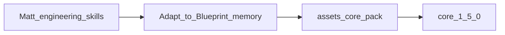

# PROPOSAL: Adopt Matt Pocock engineering skills into Blueprint

**Status:** Wave 1 executed on `feature/wave1-matt-skills` (`core` 1.5.0). Wave 2 still deferred.  
**Branch:** `feature/proposal-matt-pocock-skills`  
**Target repo:** [`assets-blueprint`](https://github.com/krerapus/assets-blueprint) (skills SoT)  
**Source:** [mattpocock/skills — engineering](https://github.com/mattpocock/skills/blob/main/skills/engineering/README.md) (MIT License, Copyright 2026 Matt Pocock)

---

## Goal

Choose which Matt Pocock engineering skills to vendor into Blueprint’s `core` pack so consumers get stronger coding/debug/review workflows **without** replacing Blueprint’s memory model (`PLANNING.md` / `DECISIONS.md` / `RUN_LOG.md` / ADR templates).

A later execute phase (after approval) would adapt selected skills, register them in inventories, and cut a **`core` pack `1.5.0`** release.

---

## Fit criteria

| Criterion | Blueprint expectation |
|---|---|
| Ownership | Skills live under `packs/core/harness/skills/`; bump pack + `catalog.yaml` |
| Naming | [`docs/standards/skill-naming.md`](docs/standards/skill-naming.md): `<action>-<object>[-<context>]` |
| Memory | Prefer Blueprint files over Matt’s `CONTEXT.md` + `docs/agents/issue-tracker.md` |
| Overlap | Do not duplicate `refactor-code`, `ponytail*`, `task-execution`, `/review` without a clear delta |
| Invocation | User-invoked Matt skills → keep `disable-model-invocation` where present; model-invoked → rich descriptions |
| License | MIT — retain copyright notice in vendored skill folders |

### Adaptation policy (locked)

| Matt concept | Blueprint mapping |
|---|---|
| `CONTEXT.md` glossary | `ARCHITECTURE.md` and/or project glossary; never require Matt’s layout |
| ADRs | Existing ADR template under `packs/core/templates/adr.md` + consumer `docs/adr/` if present |
| Spec / tickets / issue tracker | `PLANNING.md` (+ PR body / issue URL when the user supplies one) |
| Closing the loop | `task-execution` → `PLANNING.md` / `DECISIONS.md` / `RUN_LOG.md` |
| Setup skill | **Do not** adopt `setup-matt-pocock-skills` or require `docs/agents/*` for Wave 1 |



---

## Full skill matrix

### Wave 1 — Adopt (adapt + rename) → candidate for `core` 1.5.0

| Matt skill | Kind | Blueprint name | Overlap / notes |
|---|---|---|---|
| `tdd` | Model-invoked | `practice-tdd` | New capability. Keep companions `tests.md`, `mocking.md`. Map “read CONTEXT.md” → ARCHITECTURE / ADRs. |
| `diagnosing-bugs` | Model-invoked | `diagnose-bugs` | Strong red-loop discipline; no tracker dependency. |
| `code-review` | Model-invoked | `review-diff` | Two-axis Standards/Spec via sub-agents. Avoid name clash with prompt `code-review.md` and command `/review`. Spec source → `PLANNING.md` / PR body; drop `docs/agents/issue-tracker.md` requirement. |
| `codebase-design` | Model-invoked | `design-modules` | Depth/seam vocabulary; complements `ponytail` (minimalism) rather than replacing it. |
| `resolving-merge-conflicts` | Model-invoked | `resolve-merge-conflicts` | Practical git conflict playbook; no workflow conflict. |
| `research` | Model-invoked | `research-topic` | Cited research into a repo markdown file. |
| `prototype` | Model-invoked | `build-prototype` | Throwaway HTML / UI variation probes. |

**Wave 1 file footprint (execute phase):**

```text
packs/core/harness/skills/
├── practice-tdd/
│   ├── SKILL.md
│   ├── tests.md          # from Matt
│   └── mocking.md        # from Matt
├── diagnose-bugs/
│   └── SKILL.md          # (+ hitl template if kept)
├── review-diff/
│   └── SKILL.md
├── design-modules/
│   └── SKILL.md
├── resolve-merge-conflicts/
│   └── SKILL.md
├── research-topic/
│   └── SKILL.md
└── build-prototype/
    └── SKILL.md
```

Also update in the same release PR: `packs/core/manifest.yaml` skill list, [`docs/skills.md`](docs/skills.md), HARNESS skill-use-cases table (`packs/core/templates/entrypoints/HARNESS.md`), `packs/core/pack.yaml` + `VERSION` + root `catalog.yaml` → **1.5.0**.

### Wave 2 — Adapt later (needs Blueprint remapping)

| Matt skill | Kind | Why deferred |
|---|---|---|
| `domain-modeling` | Model-invoked | Hard-wired to `CONTEXT.md` / CONTEXT-MAP; rewrite for ARCHITECTURE + ADR templates first |
| `grill-with-docs` | User-invoked | Same domain-doc coupling + grilling UX; depends on domain-modeling adaptation |
| `to-spec` | User-invoked | Publishes to Matt issue-tracker config; remap to `PLANNING.md` / specs path |
| `to-tickets` | User-invoked | Tracker + triage labels; remap to PLANNING checklists or local `.scratch` without `setup-*` |
| `implement` | User-invoked | Thin orchestrator (`/tdd` + `/code-review` + commit); remap names to Wave 1 Blueprint skills + `task-execution` |
| `wayfinder` | User-invoked | Multi-session decision tickets on tracker; large remap to PLANNING / DECISIONS |
| `improve-codebase-architecture` | User-invoked | Overlaps `ponytail-audit` + `refactor-code`; adopt only if HTML report flow is wanted |

### Skip

| Matt skill | Kind | Why |
|---|---|---|
| `ask-matt` | User-invoked | Brand-specific router; Blueprint already has HARNESS skill-use-cases table |
| `setup-matt-pocock-skills` | User-invoked | Scaffolds foreign `docs/agents/*` + CONTEXT layout; fights Blueprint init/memory model |
| `triage` | User-invoked | Issue-tracker role state machine; not core harness |
| `wizard` | Model-invoked | Niche HITL bash generator; revisit only if consumers ask |

---

## Existing Blueprint skills (no change from this proposal)

Keep as-is: `task-execution`, `context-recall`, `refactor-code`, `docs-style`, `i-have-adhd`, `ponytail` (+ review/audit/debt/gain/help), `generate-test-cases`, `update-api-docs`, `skill-creator`.

Wave 1 skills should **reference** these where useful (e.g. `review-diff` may suggest `/ponytail-review`; `practice-tdd` may note `generate-test-cases` for QA CSV export — optional cross-link only).

---

## Naming gate summary

| Proposed name | Passes `<action>-<object>`? | Notes |
|---|---|---|
| `practice-tdd` | Yes | Prefer over bare `tdd` |
| `diagnose-bugs` | Yes | Renamed from `diagnosing-bugs` |
| `review-diff` | Yes | Avoids `code-review` / prompt collision |
| `design-modules` | Yes | Renamed from `codebase-design` |
| `resolve-merge-conflicts` | Yes | Renamed from `resolving-merge-conflicts` |
| `research-topic` | Yes | Clarifies object |
| `build-prototype` | Yes | Renamed from `prototype` |

---

## Execute-phase checklist (after approval — not this PR)

1. Vendor/adapt Wave 1 skill folders under `packs/core/harness/skills/` with MIT attribution.
2. Rewrite Matt-specific paths (`CONTEXT.md`, `docs/agents/issue-tracker.md`, `/setup-matt-pocock-skills`, `/tdd`, `/code-review`) to Blueprint equivalents.
3. Register skills in `packs/core/manifest.yaml` and [`docs/skills.md`](docs/skills.md).
4. Extend HARNESS **Skill use cases** table.
5. Bump `core` **1.4.x → 1.5.0** (`pack.yaml`, `VERSION`, `catalog.yaml`).
6. Smoke: sibling `BLUEPRINT_ASSETS_ROOT`, `blueprint assets install/update core`, project into a scratch consumer, confirm skills appear under runtime `skills/`.
7. Open assets PR; tag `core-v1.5.0` after merge.
8. CLI `VERSION` bump **only if** doctor/`package_skill_names` inventories in `agent-harness-blueprint` require it (pack-only usually does not).

---

## Open questions for reviewer

1. **Confirm Wave 1 set** — keep all seven, or drop any (e.g. `build-prototype`, `research-topic`)?
2. **Glossary mapping** — is “read ARCHITECTURE.md / ADRs instead of CONTEXT.md” enough, or should Wave 1 also mention optional consumer `CONTEXT.md` if present?
3. **Wave 2 interest** — do you want tracker-style `to-tickets` / `implement` remapped to `PLANNING.md` in a follow-up, or permanently skip?
4. **`improve-codebase-architecture`** — want the HTML report flow later, or permanently defer to `ponytail-audit`?
5. **Release packaging** — OK to ship Wave 1 as a single `core` 1.5.0, or prefer a staged 1.5.0 (TDD + diagnose only) then 1.6.0?

---

## Decision requested

Reply with approval (and answers to open questions if any). Until then: **no skill copies, no manifest changes, no version bump.**
