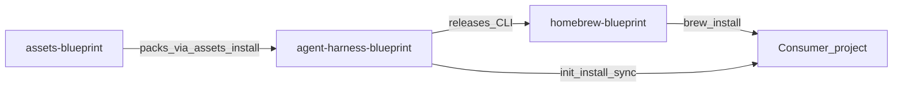

# assets-blueprint

Independently versioned static packs for the [Blueprint CLI](https://github.com/krerapus/agent-harness-blueprint).

Sibling repos: [`agent-harness-blueprint`](https://github.com/krerapus/agent-harness-blueprint) (CLI + runtime) · [`homebrew-blueprint`](https://github.com/krerapus/homebrew-blueprint) (Homebrew Formula).

---

## How it works

This repo is the **source of truth for harness content packs**. The CLI downloads (or mounts) packs; it does not own pack versioning.



Pack lifecycle:


| Piece | Role |
|-------|------|
| `packs/<name>/` | Pack contents + `pack.yaml` (`version`, `cli_compat`) |
| `catalog.yaml` | Latest pack versions and release asset names |
| GitHub Release | `<pack>-v<semver>.tar.gz` (+ `.sha256`) |
| CLI cache | `~/.cache/blueprint/assets/` and `catalog/` |

## How to use

### As a Blueprint user

After installing the CLI:

```bash
blueprint assets list
blueprint assets install core
blueprint assets update core
blueprint assets doctor --offline
```

The CLI fetches from GitHub Releases listed in `catalog.yaml` (cached under `~/.cache/blueprint/catalog/`).

### Local development (sibling checkout)

Place this repo next to `agent-harness-blueprint`, or point the CLI at it:

```bash
# From this repo root:
export BLUEPRINT_ASSETS_ROOT="$(pwd)"

# Or rely on auto-detect of ../assets-blueprint from a CLI checkout
```

Then exercise packs without publishing:

```bash
blueprint assets list
blueprint assets install core
blueprint assets doctor
```

## How to update source

1. Edit content under `packs/<name>/` (e.g. `packs/core/harness/`, templates, blueprints).
2. Bump `version` in `packs/<name>/pack.yaml` (and `cli_compat` if the pack needs a newer CLI).
3. Update the matching entry in [`catalog.yaml`](catalog.yaml) (`version`, `release_asset`, `cli_compat`).
4. Package locally:

   ```bash
   ./scripts/package-pack.sh core   # or prompts | memories | examples
   # → dist/core-vX.Y.Z.tar.gz + .sha256
   ```

5. Publish: push a tag matching the pack (`core-v1.4.0`, `prompts-v1.4.0`, …). [`.github/workflows/assets-release.yml`](.github/workflows/assets-release.yml) builds the archive and creates the GitHub Release. You can also run the workflow via `workflow_dispatch`.

Do **not** commit `dist/` artifacts unless your process explicitly requires them.

## Contributing

See [CONTRIBUTING.md](CONTRIBUTING.md) for setup, branch/commit/PR conventions, and the full update checklist.

## Packs

| Pack | Path | Contents |
|------|------|----------|
| `core` | `packs/core` | Harness commands/rules/skills, templates, blueprint profiles |
| `prompts` | `packs/prompts` | Prompt library |
| `memories` | `packs/memories` | Root memory skeletons |
| `examples` | `packs/examples` | Consumer examples |

## Docs

| Document | Contents |
|---|---|
| [docs/skills.md](docs/skills.md) | Skill inventory (`packs/core/harness/skills/`) |
| [docs/standards/skill-naming.md](docs/standards/skill-naming.md) | Skill naming standard |

## Layout

```text
assets-blueprint/
├── catalog.yaml
├── docs/
│   ├── skills.md
│   └── standards/skill-naming.md
├── packs/
│   ├── core/
│   ├── prompts/
│   ├── memories/
│   └── examples/
├── scripts/
│   └── package-pack.sh
└── .github/workflows/
    └── assets-release.yml
```

## License

MIT — see [LICENSE](LICENSE).
