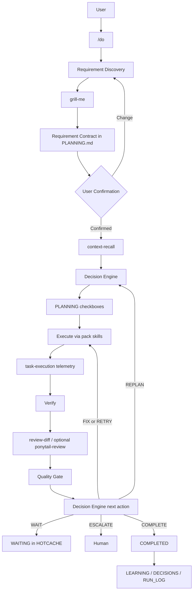

# Loop Engineering

How Blueprint turns ambiguous intent into confirmed requirements and adaptive execution.

**Status:** Implemented as skills/commands in the `core` pack (`/do`, `grill-me`, companions). Not a separate runtime binary.

**SoT:** [`packs/core/harness/skills/do/`](../packs/core/harness/skills/do/), [`packs/core/harness/skills/grill-me/`](../packs/core/harness/skills/grill-me/), [`packs/core/harness/commands/do.md`](../packs/core/harness/commands/do.md).

## Why this exists

Users should say **what** they want. Blueprint already has memory, skills, and quality gates. Loop Engineering **orchestrates** those pieces behind `/do` instead of asking users to pick agents or graphs.

## User entry: `/do`

```text
/do I want to add notification support to the application.
```

Internal path (complexity hidden unless asked):

1. Requirement discovery (`grill-me`)  
2. Requirement Contract in `PLANNING.md`  
3. User confirmation  
4. `context-recall` orient  
5. Decision Engine (capability selection)  
6. Execute via existing skills + `task-execution`  
7. Verify / `review-diff` (+ optional `ponytail-review`)  
8. Quality Gate → next action  
9. Learn / persist (`DECISIONS`, `RUN_LOG`, `LEARNING`)

## Requirement discovery

`grill-me` asks the **minimum** questions until stop conditions pass (`objective_clear`, `scope_clear`, `constraints_known`, `acceptance_criteria_defined`, `major_ambiguities_resolved`, `unresolved_risks_accepted`).

Contract schema: [`skills/do/requirement-contract.md`](../packs/core/harness/skills/do/requirement-contract.md).

## Decision Engine

Hybrid **LLM reasoning + deterministic policy** ([`decision-engine.md`](../packs/core/harness/skills/do/decision-engine.md)):

- Reasoning: classify, plan, map capabilities → skills  
- Policy: safety, authority, retry limits, required gates  

Actions: `PLAN` `EXECUTE` `VERIFY` `REVIEW` `RETRY` `REPLAN` `FIX` `SKIP` `WAIT` `ESCALATE` `COMPLETE`.

## Agents / subagents

Documented in [`contracts.md`](../packs/core/harness/skills/do/contracts.md). Primary session = Agent; `review-diff` axes / `ponytail-review` = Subagent-style passes. No new agent process model beyond Cursor/Claude/Codex sessions.

## Quality Gate

HARNESS Quality gates + structured `GateResult` (`PASS` | `FAIL` | `CONDITIONAL`). Gate ≠ Decision Engine.

## Memory

| Concern | File |
|---|---|
| Contract + tasks | `PLANNING.md` |
| Why | `DECISIONS.md` |
| Telemetry | `RUN_LOG.md` |
| Loop resume state | `HOTCACHE.md` |
| Candidates | `LEARNING.md` |

No second memory system.

## Ponytail

Cross-cutting simplicity constraint. Decision Engine may invoke `ponytail` / `ponytail-review` / `ponytail-audit` when warranted — not on every trivial task.

## Workflow diagram



## Future / Planned

- Autonomous non-Markdown decision runtime  
- `grill-with-docs` / domain-doc grilling (PROPOSAL Wave 2)  
- Spec→tickets pipelines  

Label anything not listed under **SoT** paths above as not implemented.
