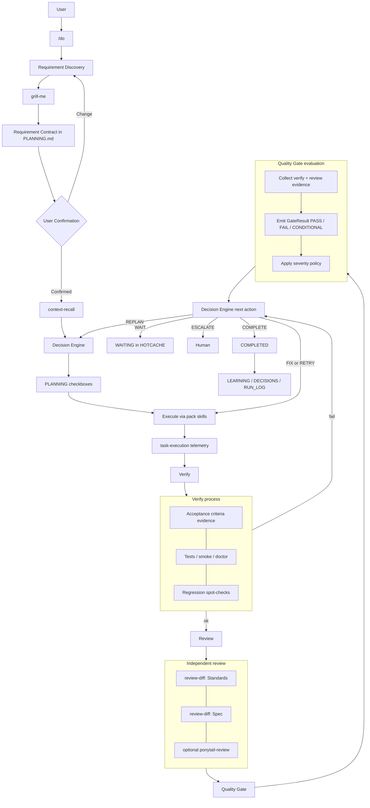

# Loop Engineering

How Blueprint turns ambiguous intent into confirmed requirements and adaptive execution.

**Status:** Implemented as skills/commands in the `core` pack (`/do`, `grill-me`, companions). Not a separate runtime binary.

**SoT:** [`packs/core/harness/skills/do/`](../packs/core/harness/skills/do/), [`packs/core/harness/skills/grill-me/`](../packs/core/harness/skills/grill-me/), [`packs/core/harness/commands/do.md`](../packs/core/harness/commands/do.md).

## Why this exists

Users should say **what** they want. Blueprint already has memory, skills, and quality gates. Loop Engineering **orchestrates** those pieces behind `/do` instead of asking users to pick agents or graphs.

## User entry: `/do`

```text
/do I want to add notification support to the application.
```

Internal path (complexity hidden unless asked):

1. Requirement discovery (`grill-me`)  
2. Requirement Contract in `PLANNING.md`  
3. User confirmation  
4. `context-recall` orient  
5. Decision Engine (capability selection)  
6. Execute via existing skills + `task-execution`  
7. Verify / `review-diff` (+ optional `ponytail-review`)  
8. Quality Gate → next action  
9. Learn / persist (`DECISIONS`, `RUN_LOG`, `LEARNING`)

## Requirement discovery

`grill-me` asks the **minimum** questions until stop conditions pass (`objective_clear`, `scope_clear`, `constraints_known`, `acceptance_criteria_defined`, `major_ambiguities_resolved`, `unresolved_risks_accepted`).

Contract schema: [`skills/do/requirement-contract.md`](../packs/core/harness/skills/do/requirement-contract.md).

## Decision Engine

Hybrid **LLM reasoning + deterministic policy** ([`decision-engine.md`](../packs/core/harness/skills/do/decision-engine.md)):

- Reasoning: classify, plan, map capabilities → skills  
- Policy: safety, authority, retry limits, required gates  

Actions: `PLAN` `EXECUTE` `VERIFY` `REVIEW` `RETRY` `REPLAN` `FIX` `SKIP` `WAIT` `ESCALATE` `COMPLETE`.

## Agents / subagents

Documented in [`contracts.md`](../packs/core/harness/skills/do/contracts.md). Primary session = Agent; `review-diff` axes / `ponytail-review` = Subagent-style passes. No new agent process model beyond Cursor/Claude/Codex sessions.

## Verify process

After a batch of execution (+ `task-execution` telemetry), the loop enters **VERIFYING** before (or alongside) review. Verify answers: *“Does the change actually work against the contract?”* — not yet *“ship it.”*

### What Verify checks

| Check | Source | Typical evidence |
|---|---|---|
| Acceptance criteria | Requirement Contract / `PLANNING.md` | Checklist items marked with how they were proven |
| Automated tests | Repo scripts / CI / `practice-tdd` | Command output, failing → red then green |
| Targeted smoke | Doctor, build, lint when relevant | `blueprint doctor`, package smoke, app smoke |
| Regression surface | Touched modules | Spot-checks for known callers / adjacent paths |
| Docs/memory sync | HARNESS completion | PLANNING / DECISIONS / RUN_LOG updated for the batch |

### Verify rules

- Prefer the **smallest** command set that can falsify the acceptance criteria (ponytail).
- Trivial edits may SKIP heavy suites; non-trivial code changes should not SKIP all verify.
- Failed verify → Decision Engine usually chooses **FIX** or **RETRY** (same plan) before full review.
- Verify does **not** replace independent review; it feeds evidence into the Quality Gate.

HOTCACHE Loop state: `VERIFYING`.

## Review (feeds the gate)

Independent of the implementer where practical:

| Pass | Skill / mechanism | Question |
|---|---|---|
| Standards | `review-diff` Standards axis | Matches repo coding standards? |
| Spec | `review-diff` Spec axis | Matches PLANNING / contract? |
| Complexity | `ponytail-review` (optional) | Unnecessary complexity to delete? |

Decision Engine selects which passes run (trivial → often skip complexity; risky diffs → include).

HOTCACHE Loop state: `REVIEWING`.

## Quality Gate

The Quality Gate answers: **“Is this good enough to proceed?”**  
The Decision Engine answers: **“What should happen next?”** — do not merge those roles.

Contract: [`contracts.md`](../packs/core/harness/skills/do/contracts.md) + HARNESS Quality gates / Completion criteria.

### Inputs

- Confirmed acceptance criteria  
- Implementation diff  
- Verify evidence (tests / smoke / doctor)  
- Review findings (Standards / Spec / optional complexity)  

### `GateResult` (not a boolean)

```yaml
GateResult:
  status: PASS | FAIL | CONDITIONAL
  findings:
    - severity: blocker | critical | warning
      category: correctness | regression | complexity | safety | spec
      description: "..."
      evidence: "..."
  evidence:
    tests: "..."
    reviews: "..."
    checks: "..."
  confidence: low | medium | high
```

| Status | Meaning | Typical next action |
|---|---|---|
| `PASS` | No blockers; AC evidenced | `COMPLETE` |
| `FAIL` | Blocker / unmet AC / required verify skipped | `FIX` / `REPLAN` / `ESCALATE` |
| `CONDITIONAL` | Warnings only; may proceed with note | `COMPLETE` (documented) or user confirm |

Severity policy (default): **blocker/critical** → fail; **warning** → pass with note unless user policy says otherwise.

HOTCACHE Loop state: `QUALITY_GATE`, then Decision Engine next action.

## Memory

| Concern | File |
|---|---|
| Contract + tasks | `PLANNING.md` |
| Why | `DECISIONS.md` |
| Telemetry | `RUN_LOG.md` |
| Loop resume state | `HOTCACHE.md` |
| Candidates | `LEARNING.md` |

No second memory system.

## Ponytail

Cross-cutting simplicity constraint. Decision Engine may invoke `ponytail` / `ponytail-review` / `ponytail-audit` when warranted — not on every trivial task.

## Workflow diagram



## Future / Planned

- Autonomous non-Markdown decision runtime  
- `grill-with-docs` / domain-doc grilling (PROPOSAL Wave 2)  
- Spec→tickets pipelines  

Label anything not listed under **SoT** paths above as not implemented.
